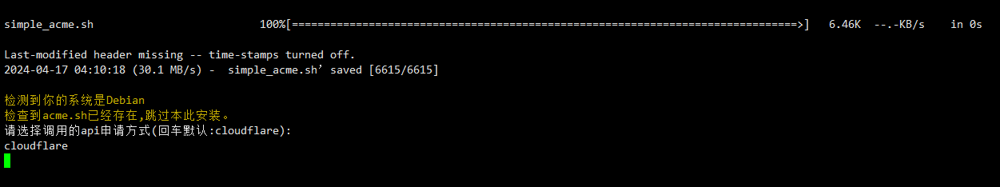
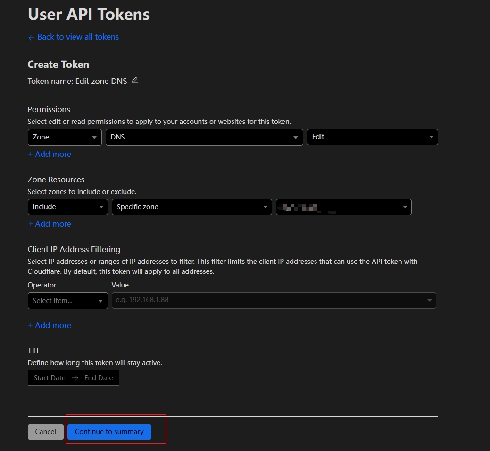
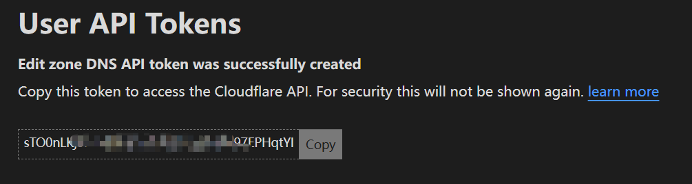
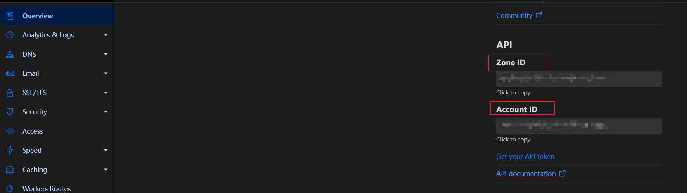
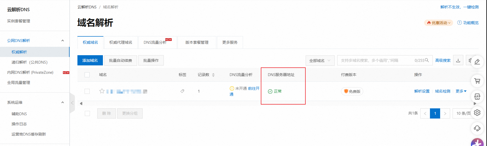
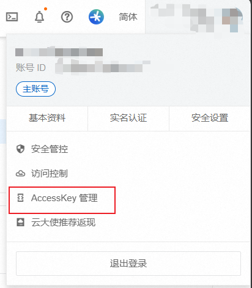
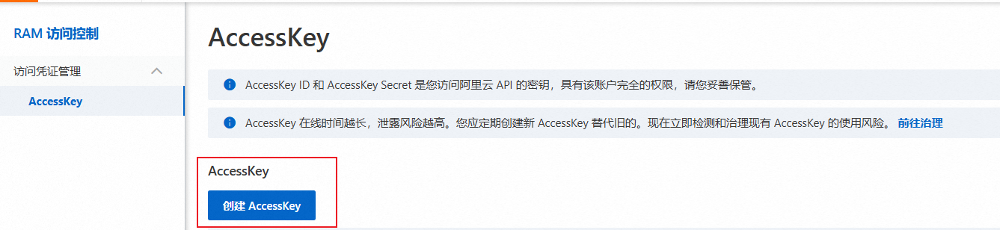
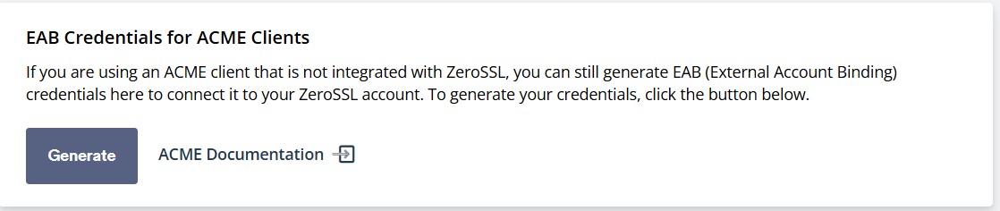

# simple_acme

Acme.sh 域名CA证书一键申请脚本,支持证书自动续签

此脚本可以帮助你快速使用[acme.sh](https://github.com/acmesh-official/acme.sh)脚本申请域名的ssl证书，并且可以保存到你想要的位置

* 证书将每 60 天自动更新一次
* 采用DNS方式认证
* 通配符证书支持
* ECC 证书, 多域 ECC 证书支持

 ***目前支持的DNS认证方式 : Cloudflare, Aliyun***

 ***目前支持的CA : ZeroSSL, Letsencrypt***

## 使用方法

```sh
wget -N https://cdn.jsdelivr.net/gh/boloc/simple_acme/simple_acme.sh && chmod +x simple_acme.sh && ./simple_acme.sh
```

> 如对你有帮助麻烦star支持一下，目前暂时支持`Cloudflare`方式申请，后续考虑增加其他类型以及完善此脚本更多功能
> 如遇到任何问题请提issue

## 简易运行示意图



## 支持的DNS方式相关使用说明

### Cloudflare

1. ***登录[Cloudflare](https://dash.cloudflare.com/profile/api-tokens), 点击`Create Token(创建令牌)`, 选择`Edit zone DNS(编辑区域 DNS)`, 点击`Use template(使用模板)`, 点击`Continue to summary(继续以显示摘要)`, 点击`Create Token(创建令牌)`***


2. 复制令牌以备使用(`CF_TOKEN`)


3.复制`CF_Account_ID` 以及 `CF_Zone_ID` 以备脚本中使用


### Aliyun

1. 使用[阿里云](https://www.aliyun.com)方式申请证书，必须将域名解析至阿里云中才可正常执行


2. 复制`AccessKey ID` 以及 `AccessKey Secret` 以备脚本中使用



## 支持的CA证书相关使用说明

### ZeroSSL

1. 注册 [ZeroSSL](https://app.zerossl.com/signup) 账号
2. 生成 [EAB](https://app.zerossl.com/developer) 凭据
 
3. 获取`EAB KID` 以及 `EAB HMAC Key` 以备使用
