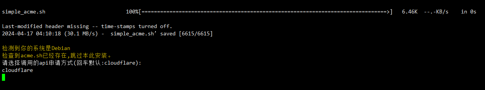

# simple_acme
Acme.sh 域名CA证书一键申请脚本,支持证书自动续签

此脚本可以帮助你快速使用[acme.sh](https://github.com/acmesh-official/acme.sh)脚本申请域名的ssl证书，并且可以保存到你想要的位置

# 使用方法
```sh
wget -N https://cdn.jsdelivr.net/gh/boloc/simple_acme/simple_acme.sh && chmod +x simple_acme.sh && bash simple_acme.sh
```

> 如对你有帮助麻烦star,fork支持一下，目前暂时支持cloudflare cdn方式申请，后续考虑增加其他类型以及增加此脚本更多功能

> 如遇到任何问题请提issue

## 简易运行示意图:

